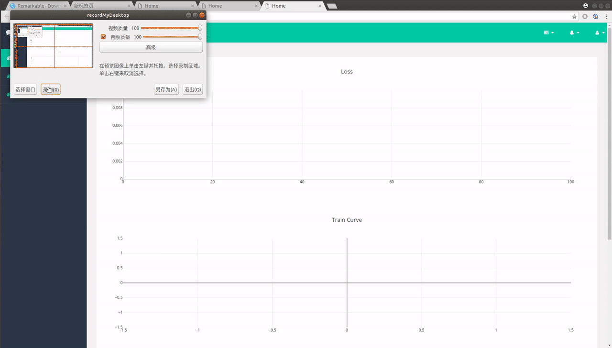
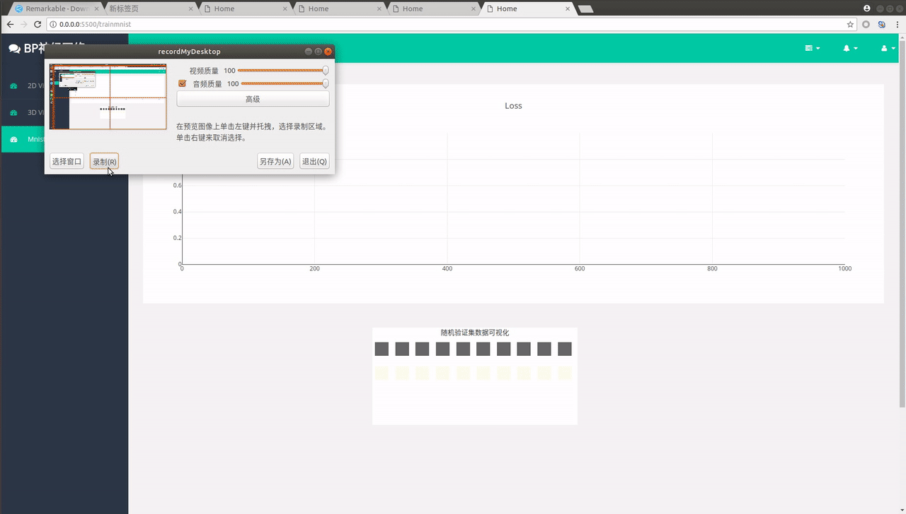
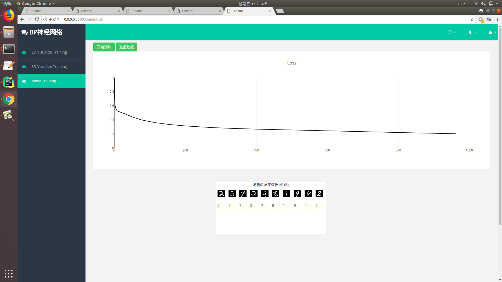

# BP-Neural-Network
> Author: Yuchao Gu

> E-mail: 2015014178@buct.edu.cn

> Date: 2018-05-27

>Description: numpy实现的Bp神经网络，代码风格参照pytorch，实现了全连接层，MSEloss，Sigmoid、Relu激活函数，以及优化器。前端可实时监控训练集loss与测试集loss以及训练测试集拟合曲线

## 结果展示

### 2d可视化训练
可拟合常用一元函数，支持的数学符号：sin，cos，power（乘方），pi 。loss曲线中橙色为验证集loss，蓝色为训练集loss



### 3d可视化训练
可拟合常用二元曲面，支持的数学符号参考2d部分


### 手写数字识别MNIST训练
训练mnist数据集，可设置验证epoch，在每个验证epoch随机抽取十张验证集数据可视化



第一轮60000张图片训练结束结果展示



## 代码解析

### 网络层基类
构造了所有网络层应实现的前向传播以及后向传播方法，以及获取参数的方法。
所有的网络层应该继承实现这个基类。
``` python
class BaseNetwork(object):
    def __init__(self):
        pass
    def forward(self,*x):
        pass

    def parameters(self):
        pass

    def backward(self,grad):
        pass
    
    def __call__(self,*x):
        return self.forward(*x)
```
### 全连接层
继承基类，实现了基类的方法。将该层参数与梯度封装进Variable，供优化器更新。
``` python
class Linear(BaseNetwork):
    def __init__(self,inplanes,outplanes,preweight=None):
        super(Linear,self).__init__()
        if preweight is None:
            self.weight = np.random.randn(inplanes, outplanes) * 0.5
            self.bias = np.random.randn(outplanes) * 0.5
        else:
            self.weight, self.bias = preweight
        self.input=None
        self.output=None
        self.wgrad=np.zeros(self.weight.shape)
        self.bgrad=np.zeros(self.bias.shape)
        self.variable=Variable(self.weight,self.wgrad,self.bias,self.bgrad)
    def parameters(self):
        return self.variable
    def forward(self,*x):
        x=x[0]
        self.input=x
        self.output=np.dot(self.input,self.weight)+self.bias
        return self.output
    def backward(self,grad):
        self.bgrad=grad
        self.wgrad += np.dot(self.input.T, grad)
        grad = np.dot(grad, self.weight.T)
        return grad
```
### 激活函数
Sigmoid激活函数存在梯度消失的问题，建议使用Relu激活函数
``` python
class Relu(BaseNetwork):
    def __init__(self):
        super(Relu,self).__init__()
        self.input=None
        self.output=None
    def forward(self,*x):
        x=x[0]
        self.input=x
        x[self.input<=0]*=0
        self.output=x
        return self.output
    def backward(self,grad):
        grad[self.input>0]*=1
        grad[self.input<=0]*=0
        return grad
```
``` python
class Sigmoid(BaseNetwork):
    def __init__(self):
        super(Sigmoid,self).__init__()
        self.input=None
        self.output=None
    def forward(self,*x):
        x=x[0]
        self.input=x
        self.output=1/(1+np.exp(-self.input))
        return self.output
    def backward(self,grad):
        grad*=self.output*(1-self.output)
        return grad
```
### 损失函数
损失函数实现了MSE(均方差损失)
``` python
class MSE(object):
    def __init__(self):
        self.label=None
        self.pred=None
        self.grad=None
        self.loss=None
    def __call__(self, pred,label):
        return self.forward(pred,label)
    def forward(self,pred,label):
        self.pred,self.label=pred,label
        self.loss=np.sum(0.5*np.square(self.pred-self.label))
        return self.loss
    def backward(self,grad=None):
        self.grad=(self.pred-self.label)
        ret_grad=np.sum(self.grad,axis=0)
        return np.expand_dims(ret_grad,axis=0)
```
### 优化器
根据梯度一次性更新所有参数
``` python
class SGD(object):
    def __init__(self,parameters,lr=0.01,momentum=0.9):
        self.parameters=parameters
        self.lr=lr
        self.momentum=momentum

    def zero_grad(self):
        for parameters in self.parameters:
            parameters.wgrad*=0
            parameters.bgrad*=0

    def step(self):
        for parameters in self.parameters:
            #parameters.v_weight=parameters.v_weight*self.momentum-self.lr*parameters.wgrad
            parameters.weight-=self.lr*parameters.wgrad
            parameters.bias-=self.lr*parameters.bgrad
```
### 定义自己的网络结构
仅需在Sequence中叠加自己的网络层即可
``` python
class Mynet(BaseNetwork):
    def __init__(self,inplanes,outplanes):
        super(Mynet,self).__init__()
        self.layers=Sequence(
            Linear(inplanes, 100),
            Relu(),
            Linear(100, outplanes)
        )
        self.criterion=MSE()

    def parameters(self):
        return self.layers.parameters()

    def forward(self,*x):
        x=x[0]
        return self.layers.forward(x)


    def backward(self,grad=None):
        grad=self.criterion.backward(grad)
        self.layers.backward(grad)

```
``` python
class Sequence(BaseNetwork):
    def __init__(self,*layer):
        super(Sequence,self).__init__()
        self.layers=[]
        self.parameter=[]
        for item in layer:
            self.layers.append(item)

        for layer in self.layers:
            if isinstance(layer,Linear):
                self.parameter.append(layer.parameters())

    def add_layer(self,layer):
        self.layers.append(layer)

    def forward(self,*x):
        x=x[0]
        for layer in self.layers:
            x=layer(x)
        return x

    def backward(self,grad):
        for layer in reversed(self.layers):
            grad=layer.backward(grad)

    def parameters(self):
        return self.parameter

```
### 训练过程
参考pytorch的写法
``` python
mynet=Mynet()
criterion=mynet.criterion
optimizer=SGD(mynet.parameters(),lr=0.00001,momentum=0.9)

for i in tqdm.tqdm(range(1000)):
    for row in range(trainx.shape[0]):
        optimizer.zero_grad()
        input=trainx[row:row+1]
        label=trainy[row:row+1]
        pred=mynet(input)
        loss=criterion(pred,label)
        running_loss+=loss
        mynet.backward()
        optimizer.step()
```
## 局限与不足
本课设由于时间仓促，存在以下局限，供参考者改进：

* 没有实现batch的参数更新

* 动量仍存在问题

* 只有基础网络结构

## 代码结构
```
BP
│
├── MnistNpy  # 存放手写数字识别预处理后的numpy文件
│ 
├── readmeDisplay # 存放本说明文件使用的图片数据
│ 
├── static # 存放网页展示所需的外部js
│ 
├── templates # 存放网页展示所需的html
│   ├── mnist.html  # 训练mnist的html与js
│   ├── train2d.html # 拟合一元函数的html与js
│   └── train3d.html # 拟合三维曲面的html与js
│
├── AIFlask.py # 后端代码
│
├── BPmain # 给后端代码写好调用接口的网络代码
│
├── BPmainOriginal.py # 不包含后端代码的原生实现，建议初学者阅读
│
└── readme.md # 此说明文件
```

## 环境

* `Python 3.6 `

* 依赖：`flask` `plotly.js`

* 系统支持：`ubuntu` 

* 编程环境:`pycharm`

## 致谢
本课设感谢  [`wlj961012`](https://github.com/wlj961012/AIHomework) 提供的关于plotly.js的基础实现，感谢  [`DIYer22`](https://github.com/DIYer22/Backpropagation) 提供的mnist训练的灵感
